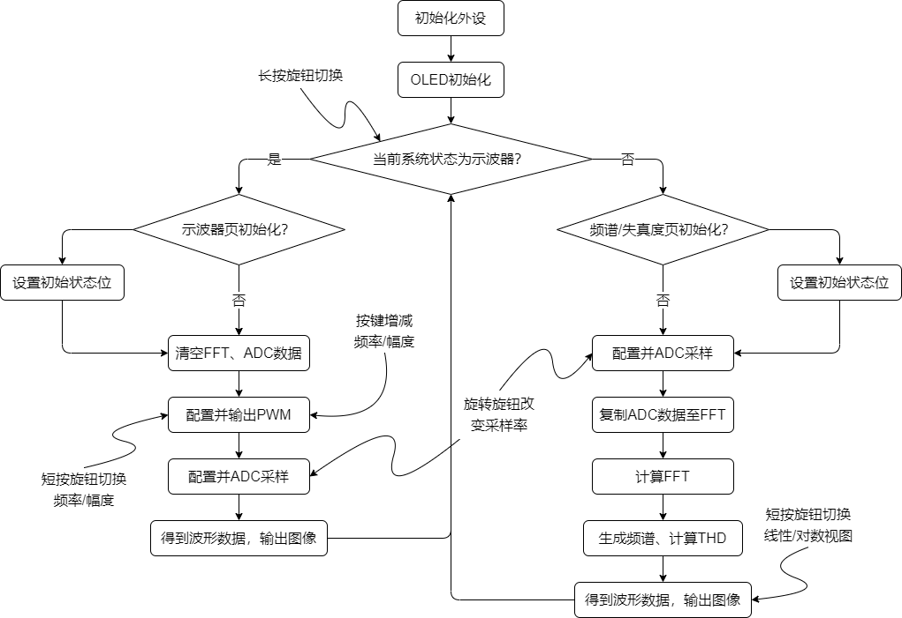

# DistortionMeter

简介：基于STM32G031的失真度测试仪，包括PWM+LPF正弦波生成，DMA+ADC采样，示波器波形显示，FFT及总谐波失真计算。

Brief: Distortion meter based on STM32G031, including sine wave generation by PWM+LPF, sampling by DMA+ADC, oscilloscope display , FFT and THD calculation.

# Developing Environment

该工程通过CubeMX与Keil5开发，通过Programmer及UART下载至芯片运行。

`./demo/dmo.ioc`为外设配置文件，可通过CubeMX打开；`./demo/MDK-ARM`为Keil5工程文件。

# Project Structure

For more details, please see:

👉 my CSDN: [基于STM32G031的失真度测试仪（CubeMX+ADC+DMA+OLED+EC11）](https://blog.csdn.net/weixin_46422143/article/details/122949391 "基于STM32G031的失真度测试仪（CubeMX+ADC+DMA+OLED+EC11）")

👉 my eetree project introduction: [基于STM32G031的失真度测试仪](https://www.eetree.cn/project/detail/899 "基于STM32G031的失真度测试仪")

# Author

KafCoppelia / 葉SiR
